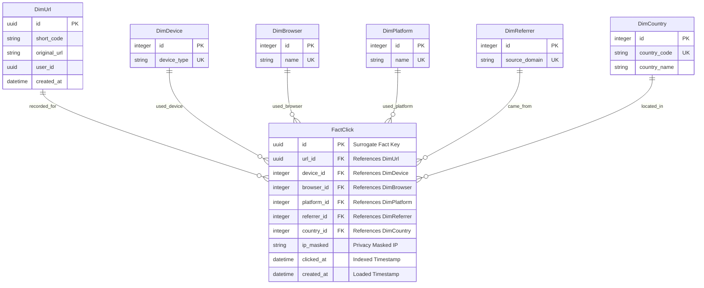

# Synerry Corporation — Developer Examination: Enterprise Short URL & Analytics Platform
## Analytics Engine & Data Pipeline (`synerry-shortener-analytic`)

บริการคลังข้อมูลและการวิเคราะห์สถิติ (Analytics Engine & Data Pipeline) พัฒนาด้วย Python 3.12, FastAPI, SQLAlchemy 2.0, และ Pandas ทำหน้าที่ดึงข้อมูล Raw Clicks จาก Core DB (OLTP) ผ่านกระบวนการ Extract -> Transform -> Load (ETL) เพื่อแปลงข้อมูลเป็นมิติต่างๆ และจัดเก็บลง Star Schema Data Warehouse (`shorturl_analytics_db`)

---

## ข้อมูลการส่งแบบทดสอบและการเข้าใช้งาน (Submission & Live Testing)

* **URL สำหรับทดสอบระบบออนไลน์**: [https://synerry-shortener.eastasia.cloudapp.azure.com](https://synerry-shortener.eastasia.cloudapp.azure.com)
* **ลิงก์ Repositories ของระบบทั้งหมด (Microservices Architecture)**:
  * **Frontend Repository**: [https://github.com/sangketkit01/synerry-shortener-frontend](https://github.com/sangketkit01/synerry-shortener-frontend)
  * **Core Backend Repository**: [https://github.com/sangketkit01/synerry-shortener-backend](https://github.com/sangketkit01/synerry-shortener-backend)
  * **Analytics Engine Repository**: [https://github.com/sangketkit01/synerry-shortener-analytic](https://github.com/sangketkit01/synerry-shortener-analytic)

### ข้อมูลบัญชีผู้ใช้สำหรับทดสอบ (Test Credentials)

| บทบาท (Role) | อีเมล (Email) | รหัสผ่าน (Password) | สิทธิ์การเข้าถึง |
|---|---|---|---|
| **System Administrator** | `admin@synerry.com` | `Admin@123456` | บริหารจัดการระบบ, ตรวจสอบผู้ใช้, ระงับ/แบนลิงก์, ระงับบัญชีผู้ใช้ และสั่งรัน ETL Pipeline |
| **Standard User** | `demo@synerry.com` | `Demo@123456` | ย่อลิงก์, กำหนด Custom Slug, ตั้งวันหมดอายุ, จัดหมวดหมู่, ดูสถิติกราฟ และ Export CSV |

---

## ตารางสรุปการตอบโจทย์ตามเกณฑ์การตัดสิน (Exam Criteria Compliance)

| ข้อที่ | เกณฑ์การพิจารณาตามโจทย์ | ผลลัพธ์ในระบบ | ฟังก์ชันและการทำงานที่พัฒนา |
|:---:|---|:---:|---|
| **1** | **Data Flow Diagram (DFD Level 0)** | **ผ่านสมบูรณ์** | ออกแบบ DFD Level 0 (Context Diagram) ครอบคลุมการทำงานทั้ง Guest, User, Admin, Visitor และ Data Store ชัดเจน |
| **2** | **Entity-Relationship Diagram (ERD)** | **ผ่านสมบูรณ์** | ออกแบบ ER Diagram แสดงความสัมพันธ์ตารางอย่างครบถ้วน โดยแยกขาดระหว่าง Core OLTP และ Analytics OLAP Star Schema |
| **3** | **สาธิตการสร้าง Short URL ได้** | **ผ่านสมบูรณ์** | กรอก Long URL และสร้าง Short URL ได้จริง รองรับ Base62 Slug และ Custom Alias และคลิกเปิดไปยัง URL ต้นฉบับด้วย HTTP 302 Redirection ในเวลา < 15ms |
| **4** | **สาธิตการสร้าง QR Code ของ Short URL ได้** | **ผ่านสมบูรณ์** | สร้าง QR Code แบบ Real-time Vector สามารถสแกนด้วยกล้องมือถือเพื่อวิ่งไปยัง URL ปลายทางได้จริง พร้อมปรับสีพื้นหน้า/พื้นหลัง และดาวน์โหลดเป็น PNG หรือ SVG |
| **5** | **สาธิตการเก็บประวัติและแสดงสถิติการคลิก** | **ผ่านสมบูรณ์** | มีหน้า Dashboard แสดงรายการประวัติลิงก์ และหน้า Analytics แสดงสถิติการคลิก, กราฟแนวโน้ม 7 วัน, แยกประเภทอุปกรณ์, เว็บบราวเซอร์, ระบบปฏิบัติการ และประเทศ |
| **6** | **ฟังก์ชันเพิ่มเติม / Microservices / Architecture** | **พิจารณาเป็นพิเศษ** | สถาปัตยกรรม Microservices 3 ชั้น, แยกฐานข้อมูล Core OLTP และ Analytics OLAP, ระบบ Data Pipeline (ETL) ป้องกันคอขวด, และระบบรักษาความปลอดภัยบัญชี |

---

## แผนผัง Star Schema Data Warehouse (OLAP: `shorturl_analytics_db`)



---

## รอบการทำงานของ Data Pipeline (ETL Execution)

1. **Daily Batch Ingestion (APScheduler)**:
   - ทำงานอัตโนมัติทุกวันเวลา **22:00 น. (UTC)** เพื่อกวาดบันทึกการคลิกทั้งหมดที่เกิดขึ้นในวันนั้น แปลงมิติและจัดเก็บลงคลังข้อมูล
2. **On-Demand Manual Sync**:
   - เมื่อผู้ใช้งานหรือผู้ดูแลระบบกดปุ่ม **Refresh** ในหน้า Analytics ตัวระบบจะสั่งยิงคำขอ `POST /api/v1/analytics/pipeline/trigger` เพื่อรัน ETL Sync ข้อมูลสดใหม่ทันที

---

## คู่มือการติดตั้งและเริ่มใช้งานในเครื่อง (Local Installation)

### วิธีที่ 1: รันผ่าน Docker Compose
```bash
cd ..
docker compose up -d
```

### วิธีที่ 2: รันเฉพาะ Analytics Service (Python)
```bash
# 1. สร้าง Virtual Environment
python -m venv venv
# บน Windows:
.\venv\Scripts\activate
# บน Linux/macOS:
# source venv/bin/activate

# 2. ติดตั้ง Dependencies
pip install -r requirements.txt

# 3. ตั้งค่าไฟล์ Environment (.env)
cp .env.example .env

# 4. เริ่มรันเซิร์ฟเวอร์โหมดพัฒนา
python -m uvicorn src.main:app --host 0.0.0.0 --port 8000 --reload
# พร้อมใช้งานที่ http://localhost:8000
```
